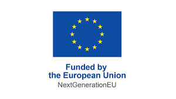

<p align="right">
  
</p>

<p align="center">
  
</p>
<p align="center">
  <b>d16n - Depseudonymisation</b>
</p>

## Description

<!-- TODO replace this with mermaid / PUML -->

```
                       1. auth + get pseudonym

              +-------------+           +-----+
              | App Backend | <-------> | IDP |
              +-------------+           +-----+
 2. get access token ^                     ^
                     |                     |
              +--------------+             |
              | App Frontend |-------------+  3 Resolve pseudonym
              +--------------+              aka retrieve clear names

```
<!--

Thoughts:
- The App Frontend should be separated from the App Backend
- It should be clearly labelled that the clear names don't pass through the
  app.

-->


### Why

<!--

Here I think we want to write about how the GDPR or we in the EdTech industry
place a particulary high value on the data privacy of children.
Children are of particular importance - they have so much to learn!

Why should EdTech's be interested in this specification?
... something about the benefits of implementing specs
... something about lower burden of GDPR compliance

-->


### What

This is a specification and implementation guide for interoperability of
educational apps and user identity systems such that apps can show user
names without revealing those names to the creator of the app.

### For Whom

- You are an Identity Provider who works in the education system.
- You are an EdTech with an app to use in the school system.


## Specification

The latest version of the specification is 1.0

The rendered version can be viewed ... <!-- TODO: link to >

The source is found in [spec/](spec/)
- [D16N Specification 1.0](spec/d16n-v1_0.adoc)

<!--

Do we want to have the whole specification in this README? or should it be a
separate doc? e.g. it could be a generated html page served on github pages...
🤷

-->

## Implementers

The following providers and apps have implemented this.
Implementers can open a pull request against this repository to add their
details.
There is no certification process and implementations are not required to be
open source.

<!--
TODO: ask bettermarks' existing partners if we/they can add their details here
already.
-->

### Identity Providers

Project Name        | Maintainers       | Point of Contact      | Project URL
------------------- | ----------------- | --------------------- | -----------


### Applications

Project Name    | Maintainers      | Point of Contact           | Project URL
--------------- | ---------------- | -------------------------- | ----------------------------
bettermarks     | bettermarks GmbH | kontakt@bettermarks.com    | https://bettermarks.com/


