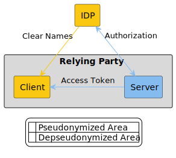

  

  

  <b>d16n - Depseudonymisation</b>

## Description

### Why

<!--

Here I think we want to write about how the GDPR or we in the EdTech industry
place a particulary high value on the data privacy of children.
Children are of particular importance - they have so much to learn!

Why should EdTech's be interested in this specification?
... something about the benefits of implementing specs
... something about lower burden of GDPR compliance

-->

#### _Draft 1_

Children have a lot to learn, so we want to offer them digital learning
experiences in the form of apps.

In order to have a productive learning experience,
their teachers need to be able to identify the work of their students.
This is easiest when the teacher can see their students identified by the same
name they use in all apps and, in particular, the name used in the classroom.

However, as app creators we have a special duty to protect the personal data
of children. The simplest way to do that is to not receive it.

#### _Draft 2_

Per the [GDPR][GDPR],
children merit specific protection with regard to their personal.
The best way to protect that data is not to process it.

We want to have a simple and common way for teachers to recognise their
students without putting their data at risk.

[GDPR]: https://eur-lex.europa.eu/eli/reg/2016/679/oj

#### _Draft 3_

As app creators we have a special duty to protect the personal data of
children. The simplest way to do that is to not receive it.

We want to have a simple and common way for teachers to recognise their
students without putting their data at risk.

### What

This is a specification and implementation guide for interoperability of
educational apps and user identity systems such that apps can show user
names without revealing those names to the creator of the app.

We name it client-side depseudonymisation or simply d16n.

D16N refers to the Depseudonymisation process used in integrations, where
pseudonyms (abstract IDs) are exchanged instead of clear user names. This
functionality allows a user's browser to communicate directly with IDP
servers to resolve these IDs into identifiable names. D16N enhances privacy by
ensuring that user identities remain protected during data exchanges,
particularly in educational contexts where sensitive information is involved.

### For Whom

- You are an Identity Provider who works in the education system.
- You are an EdTech with an app to use in the school system.

## Specification

The latest version of the specification is 1.0

The rendered version can be viewed [here](https://bettermarks.github.io/d16n/spec/d16n-v1_0.html).

The source is found in [spec/](spec/)
- [D16N Specification 1.0](spec/d16n-v1_0.adoc)

## Implementers

The following providers and apps have implemented this.
Implementers can open a pull request against this repository to add their
details.
There is no certification process and implementations are not required to be
open source.

<!--
TODO: ask bettermarks' existing partners if we/they can add their details here
already.
-->

### Identity Providers

Product Name        | Maintainers       | Point of Contact      | URL
------------------- | ----------------- | --------------------- | -----------

### Applications

Product Name    | Maintainers      | Point of Contact           | URL
--------------- | ---------------- | -------------------------- | --------------------------
bettermarks     | bettermarks GmbH | kontakt@bettermarks.com    | https://bettermarks.com/

