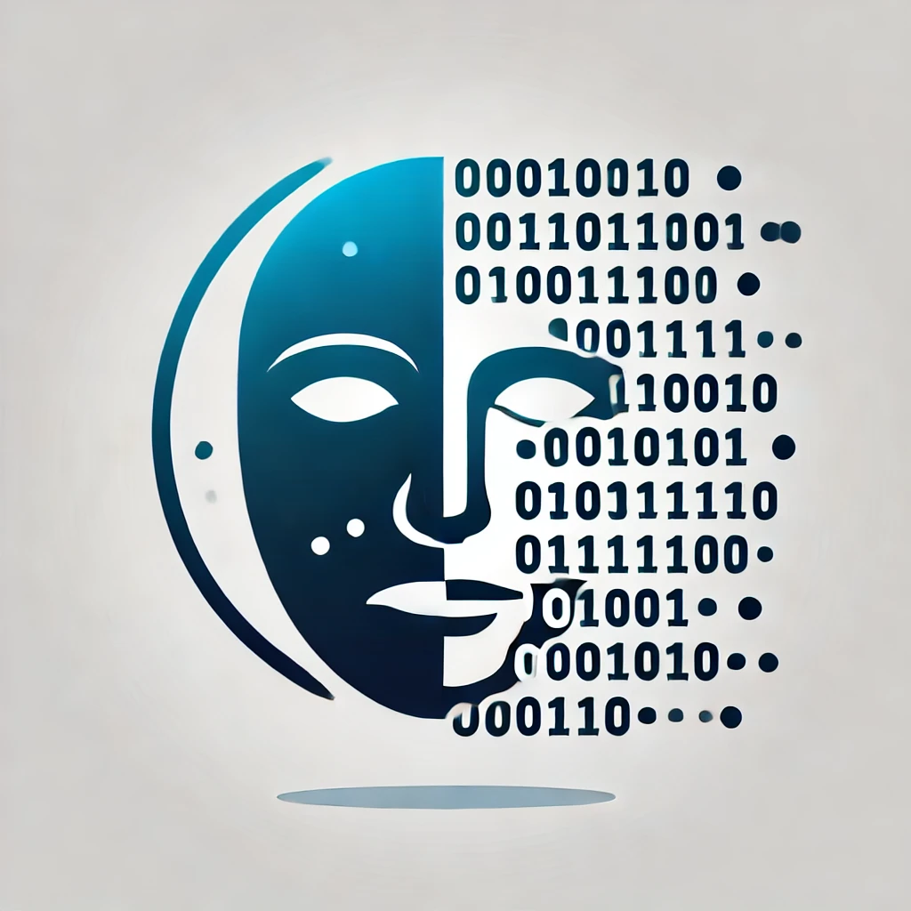

  

  

  <b>d16n - Depseudonymisation</b>

## Description

### Why

As app creators, we have a profound responsibility to safeguard the personal
data of children. The most effective way to protect it is to avoid collecting
it altogether.

Our goal is to provide a simple and standardized method for teachers to identify
their students without compromising their data security.

### What

This is a specification and implementation guide for interoperability of
educational apps and user identity systems such that apps can show user
names without revealing those names to the creator of the app.

We name it client-side depseudonymisation or simply d16n.

D16N refers to the Depseudonymisation process used in integrations, where
pseudonyms (abstract IDs) are exchanged instead of clear user names. This
functionality allows a user's browser to communicate directly with IDP
servers to resolve these IDs into identifiable names. D16N enhances privacy by
ensuring that user identities remain protected during data exchanges,
particularly in educational contexts where sensitive information is involved.

### For Whom

- You are an Identity Provider who works in the education system.
- You are an EdTech with an app to use in the school system.

## Specification

The latest version of the specification is 1.0

The rendered version can be viewed [here](https://bettermarks.github.io/d16n/spec/d16n-v1_0.html).

The source is found in [spec/](spec/)
- [D16N Specification 1.0](spec/d16n-v1_0.adoc)

## Implementers

The following providers and apps have implemented this.
Implementers can open a pull request against this repository to add their
details.
There is no certification process and implementations are not required to be
open source.

<!--
TODO: ask bettermarks' existing partners if we/they can add their details here
already.
-->

### Identity Providers

Product Name        | Maintainers       | Point of Contact      | URL
------------------- | ----------------- | --------------------- | -----------

### Applications

Product Name    | Maintainers      | Point of Contact           | URL
--------------- | ---------------- | -------------------------- | --------------------------
bettermarks     | bettermarks GmbH | kontakt@bettermarks.com    | https://bettermarks.com/

